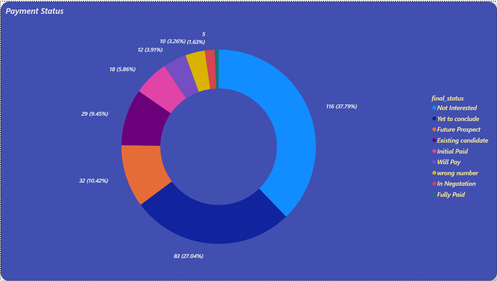
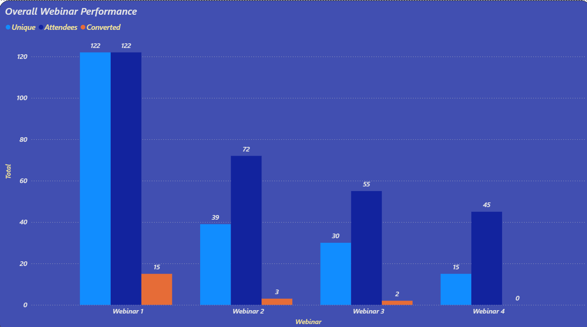

# 📊 Webinar Performance Dashboard

An interactive data visualization project designed to analyze the performance of webinars conducted over a defined period. The dashboard provides insight into attendee behavior, conversion effectiveness, intern productivity, and overall operational efficiency.

---

## 🚀 Objective

To track and improve the efficiency of webinar campaigns by measuring key performance indicators (KPIs) like attendance, conversion, churn, segment-wise participation, L1 productivity, and engagement over time.

---

## 🛠 Tools Used

- **Microsoft Power BI / Excel**
- Data Transformation and Cleaning
- DAX Calculations
- Chart Customization
- Color-coded Segmentation
- Dynamic Filters (Segments, Employees)

---

## 📈 KPI Summary

| Metric | Value |
|--------|-------|
| **Total Conversion Rate** | `26.66%` |
| **Total Attendees**       | `294`    |
| **Total Churn Rate**      | `1.93%`  |
| **Total Churn Count**     | `161`    |

---

## 📊 Dashboard Sections & Visuals

### 🔘 1. Payment Status
Tracks the distribution of payment statuses including Fully Paid, In Negotiation, Future Prospect, etc.

---

### 📊 2. Overall Webinar Performance
Displays total unique users, total attendees, and converted leads across all webinars.

---

### 👥 3. Total Interns by L1s
Shows how many interns were handled by each L1.

---

### 📘 4. Sessions Attended by L1s
Represents how many sessions each L1 attended.

---

### 💬 5. One-to-One Attended L1s
Breakdown of individual one-on-one sessions conducted by each L1.

---

### 🔁 6. Retargeted Leads by L1s
Insights into how many leads were retargeted by each L1.

---

### 📤 7. Shares by L1s (Webinar-wise)
Visualization of content shared by each L1 for Webinar 1, 2, and 3.

---

### 📦 8. Attendees Count by Segment
Breaks down attendance by categories like Ghost-outs, Potential, Drop-outs.

---

### 🎯 9. Sessions Attended by Interns
Detailed chart showing intern-wise attendance across sessions.

---

### 📉 10. Churn Count by L1s
Churn trends by L1, indicating how many leads were lost after each webinar.

---

### 🔻 11. Churn Percentage by L1s
Visual percentage comparison of churned interns across L1s.

---

### 📅 12. Sessions Attended by L1s (Webinar-wise)
Chart showing how many sessions each L1 attended in individual webinars.

---

## 🧠 Insights & Takeaways

- **Webinar 1** had the highest conversion rate and participation.
- **Preeti & Avinash** contributed the most to intern handling.
- **Ghost-outs** remain a major dropout segment.
- **Churn** is highest in Preeti’s batch, indicating a need for retention strategies.
- **Sessions** conducted are highly correlated with higher conversions.

---

## ✍️ Author

**Sanju S**  
_Data Analyst & BI Developer_  
GitHub: [github.com/your-username](https://github.com/sk-sanju)

---

## 📌 How to Use

1. Clone this repo  
   `git clone https://github.com/sk-sanju/webinar-performance-analysis.git`

2. Open the `.pbix` or `.xlsx` file (if included)

3. View screenshots for quick reference

---

## 📄 License

MIT License – free to use, modify, and share with attribution.
